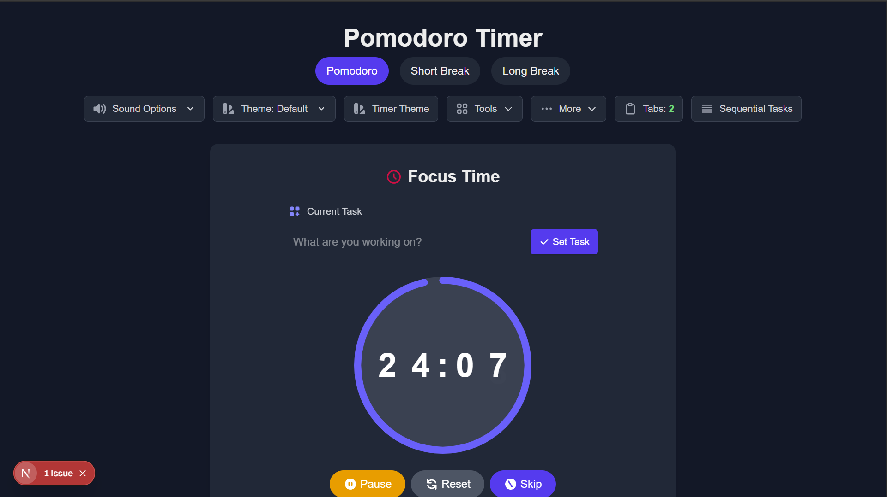

# Pomodoro Timer App

A web-based productivity tool that helps you implement the Pomodoro technique for focusing and taking breaks at regular intervals. This application is developed with Next.js and can be installed as a Progressive Web App (PWA) for offline use.



## Key Features

- ⏱️ Timers for focus time (Pomodoro), short break, and long break
- 🔄 Automatic transitions between sessions according to the Pomodoro technique
- ✅ Task management with drag-and-drop system
- 📊 Statistics and session history
- 🔔 Notifications when timer completes
- 🎵 Notification sound options and background music
- 🎯 Gamification with achievements for motivation
- 🌙 Focus mode to eliminate distractions
- 🎨 Various themes for timer and UI
- 🔄 Synchronization across browser tabs
- 📱 Progressive Web App (PWA) for offline use

## Installation

```bash
# Clone repository
git clone https://github.com/thefahmi/pomodoro-timer.git
cd pomodoro-timer

# Install dependencies
npm install

# Run in development mode
npm run dev

# Build for production
npm run build

# Run production version (to test PWA)
npm run start
```

## Usage

1. Open the application in your browser
2. Start a Pomodoro session with the Play button
3. Work on your tasks for 25 minutes (default)
4. When the timer ends, start your break time
5. Repeat the cycle for maximum productivity

## Using as PWA

To use the application as a PWA:

1. Open the application in your browser (Chrome/Edge recommended)
2. Look for the installation icon in the address bar or browser menu
3. Click "Install" to add the application to your desktop/home screen
4. The application can be used even when offline

## Technologies

- Next.js
- React
- Framer Motion
- Tailwind CSS
- next-pwa
- Workbox

## License

MIT License

## Contribution

Contributions, issues, and pull requests are welcome. Please create an issue first for discussion before making major changes.
